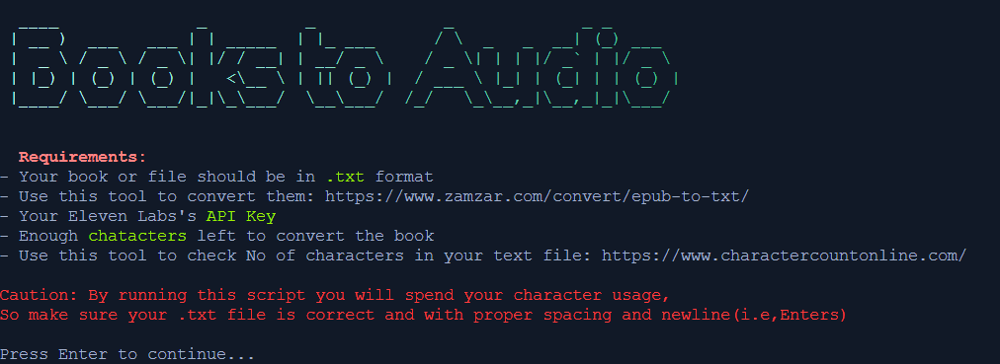
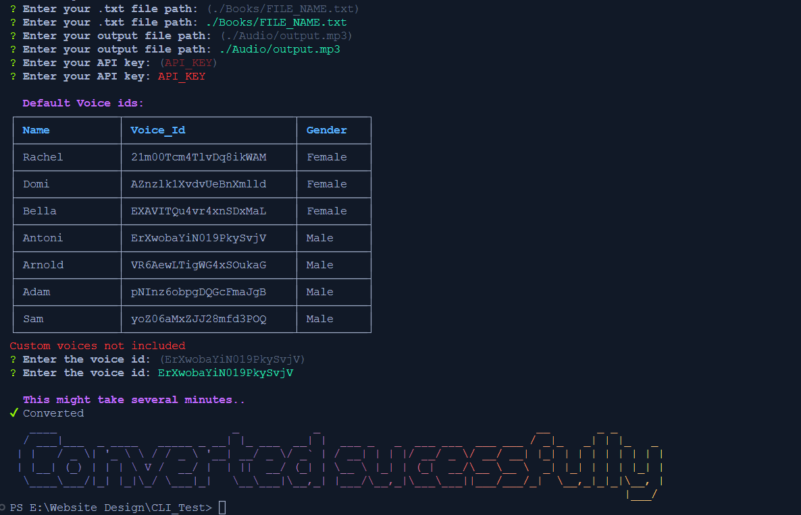

<br/>
<p align="center">
  <h3 align="center">Books to Audio</h3>

  <p align="center">
    Why read? when you can Listen
    <br/>
    <br/>
    <a href="https://github.com/Amethesh/Books-to-Audio/issues">Report Bug</a>
    .
    <a href="https://github.com/Amethesh/Books-to-Audio/issues">Request Feature</a>
  </p>
</p>

    

## Table Of Contents

- [Table Of Contents](#table-of-contents)
- [About The Project](#about-the-project)
  - [Built With](#built-with)
  - [Run anywhere using](#run-anywhere-using)
  - [Run locally](#run-locally)
- [Usage](#usage)
- [Contributing](#contributing)
  - [Creating A Pull Request](#creating-a-pull-request)
- [Authors](#authors)
- [Acknowledgements](#acknowledgements)
- [Enjoy](#enjoy)

## About The Project

****

Books-to-Audio is a Node.js script that converts text files into audio files using AI text-to-speech using **Eleven Labs API**. This script can be used to listen to your favorite books, articles, or any text-based content while doing other activities such as commuting, working out, or doing household chores.

The script is designed to work with text files in the .txt format.


### Built With

- Nodejs
- Elevens's Lab API

### Run anywhere using

```
npx books-to-audio
```
### Run locally

1. Get a free API Key at https://beta.elevenlabs.io/speech-synthesis

2. Clone the repo

```sh
git clone https://github.com/Amethesh/Books-to-Audio.git
```

3. Install NPM packages

```sh
npm install
```

4. Run the commander.js

```JS
npm start
```

## Usage

You can use the CLI to convert any books or large text into audio


## Contributing

Contributions are what make the open source community such an amazing place to be learn, inspire, and create. Any contributions you make are **greatly appreciated**.
* If you have suggestions for adding or removing projects, feel free to [open an issue](https://github.com/Amethesh/Books-to-Audio/issues/new) to discuss it, or directly create a pull request after you edit the *README.md* file with necessary changes.
* Please make sure you check your spelling and grammar.
* Create individual PR for each suggestion.

### Creating A Pull Request

1. Fork the Project
2. Create your Feature Branch (`git checkout -b feature/AmazingFeature`)
3. Commit your Changes (`git commit -m 'Add some AmazingFeature'`)
4. Push to the Branch (`git push origin feature/AmazingFeature`)
5. Open a Pull Request

## Authors

*  [Amethesh](https://github.com/Amethesh) - *College student*

## Acknowledgements

* [Prasanth-BS](https://github.com/Prasanth-BS) - *Fellow college student*
  
## Enjoy

